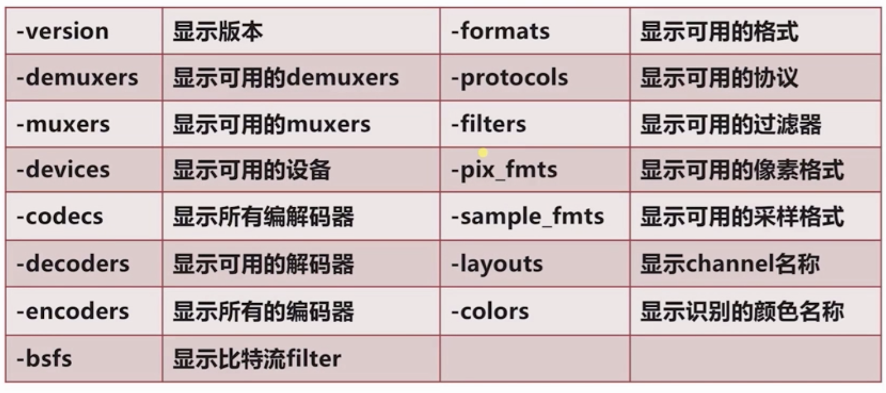

# FFmpeg 命令


## FFmpeg处理流程

## FFmpeg命令分类

> FFmpeg 基本命令格式

```
ffmpeg [global_options] {[input_file_options] -i input_url} {[output_file_options] output_url}
```

1. 基本信息查询命令
2. 录制命令
3. 分解/复用命令
4. 处理原始数据命令
5. 各种滤镜命令
6. 裁剪与合并命令
7. 图片/视频互转命令
8. 直播相关命令


## 1. 基本信息查询命令



## 2. 录制命令

## 3. 分解/复用命令

## 4. 处理原始数据命令

## 5. 各种滤镜命令

## 6. 裁剪与合并命令

## 7. 图片/视频互转命令

> 视频拆分成图片

`-r 30` 表示每秒钟限制30帧数

```shell
ffmpeg -i 01.mp4 image-%5d.jpeg
ffmpeg -i ./images/%d.jpg -r 30 test.mp4
```


> 图片合成视频

```shell
ffmpeg -i ./image-%5d.jpeg output.mp4
```


## 8. 直播相关命令


参考资料:

- [FFmpeg常用命令](https://www.jianshu.com/p/91727ab25227)
